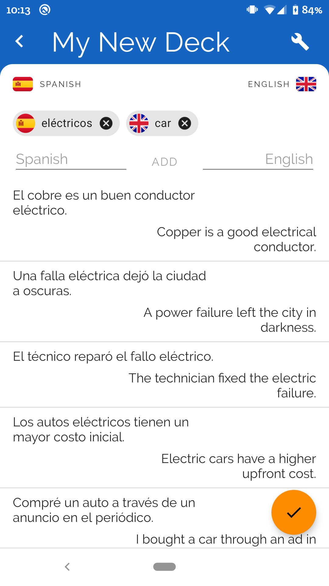
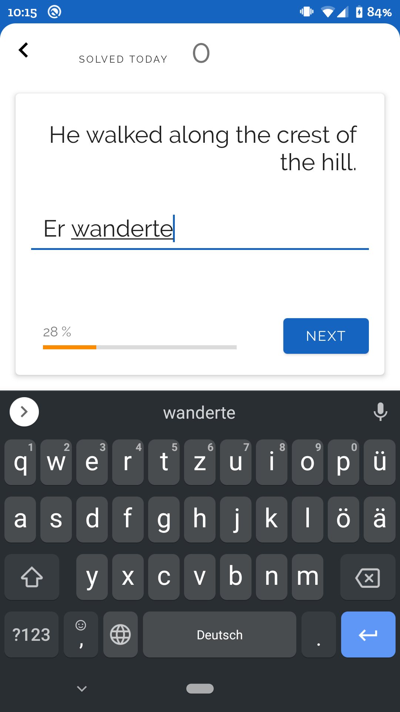
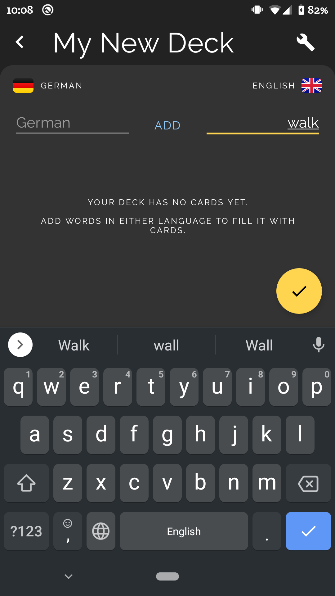
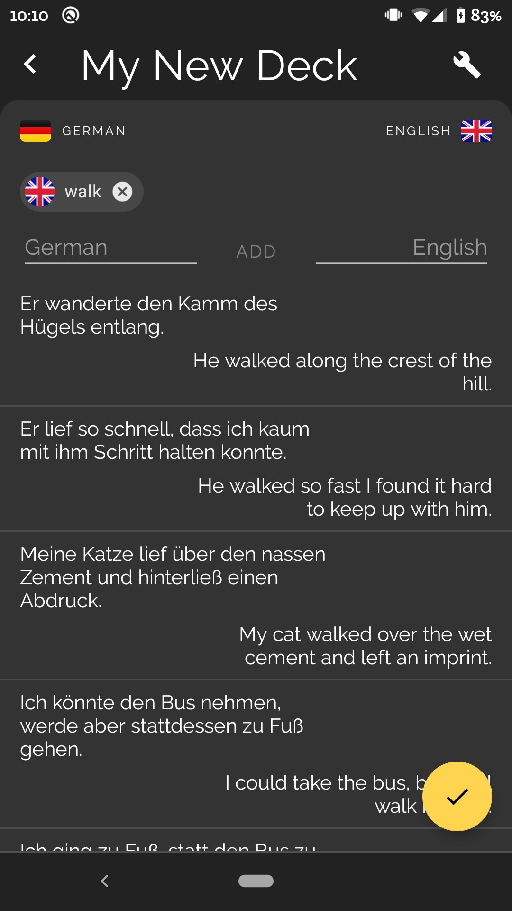
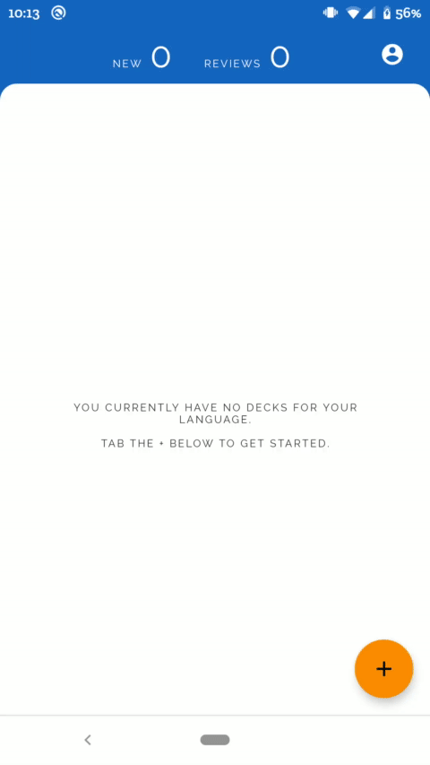
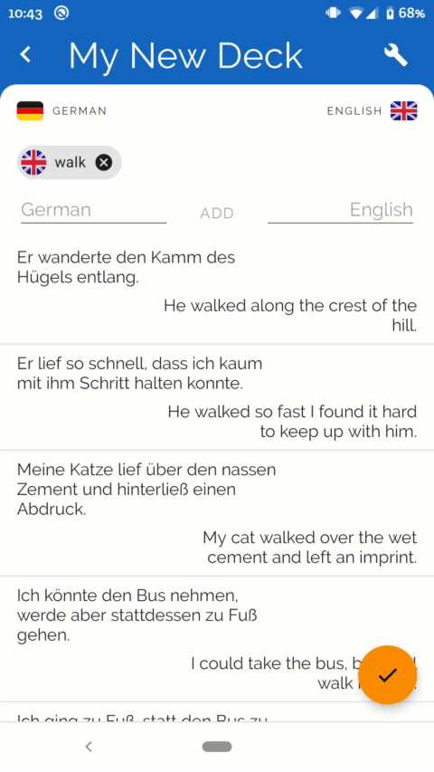
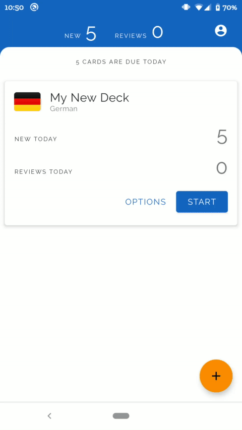

# Syntact

Syntact is an App for learning languages that generates flashcards and organizes them into decks. These flashcards can be learnt and reviewed using a simple spaced repetition algorithm.

## Technologies

* [Kotlin](https://kotlinlang.org/)
* [Dagger 2](https://dagger.dev/) for Dependency Injection
* [Android Architecture Components](https://developer.android.com/topic/libraries/architecture), such as [Room Persistence Library](https://developer.android.com/topic/libraries/architecture/room), [ViewModel](https://developer.android.com/topic/libraries/architecture/viewmodel), [LiveData](https://developer.android.com/topic/libraries/architecture/livedata), [Navigation](https://developer.android.com/guide/navigation)
* [Material Design](https://material.io/)

## Build

## Screenshots

<table><tr>
   <td width="25%"></td>
   <td width="25%"></td>
   <td width="25%"></td>
   <td width="25%"></td>
</tr>
  </table>

## Showcase

<table>

<tr>
    <td width="33%">Tap to + in the main screen to create a new deck. Type a word in either language and tap ADD to generate suggestions for sentences containing that word.</td>
    <td width="33%">Tapping on a suggestion allows you to delete it or use its sentences' words as additional input words.</td>
  <td width="33%">Finalize your deck by naming it and deciding how many new cards you want to be shown a day.</td>
</tr>
<tr>
   <td width="33%"></td>
   <td width="33%"></td>
   <td width="33%"></td>
</tr>
</table>

<table>

<tr>
    <td width="33%">Start learning by pressing START and typing in the solution. A minimum 90% accordance with the correct solution counts as a correct try, and as a failure otherwise.</td>
    <td width="33%">Tap OPTIONS on a deck to see its details, revealing each card's next due date and the opportunity to adjust deck settings.</td>
  <td width="33%">Toggle Dark Mode with three different options: on, off or automatic.</td>
</tr>
<tr>
   <td width="33%"></td>
   <td width="33%"></td>
   <td width="33%"></td>
</tr>
</table>

